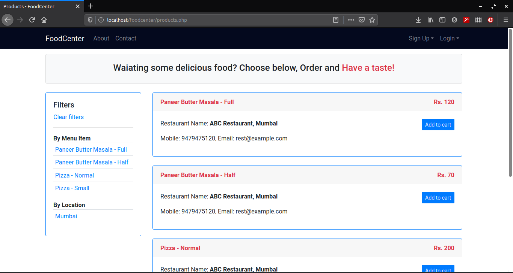
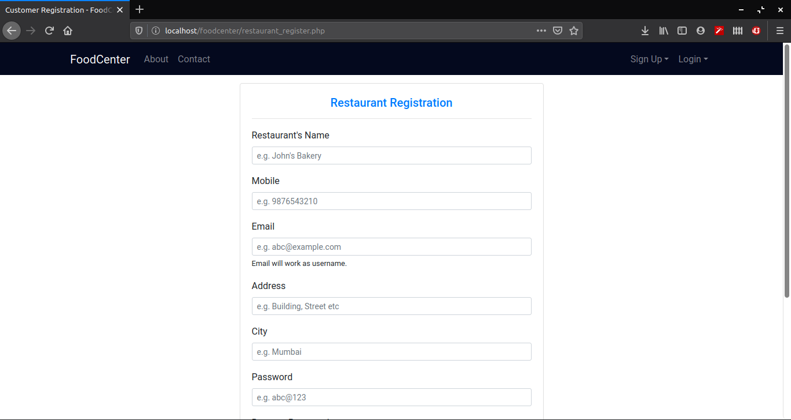
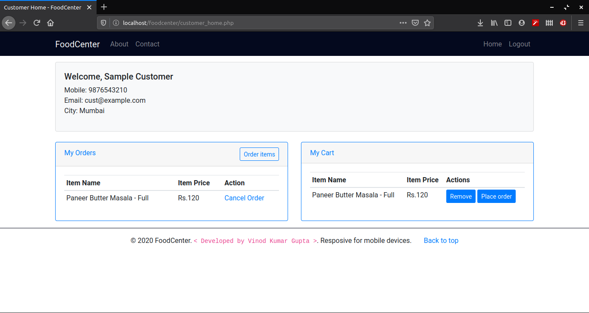
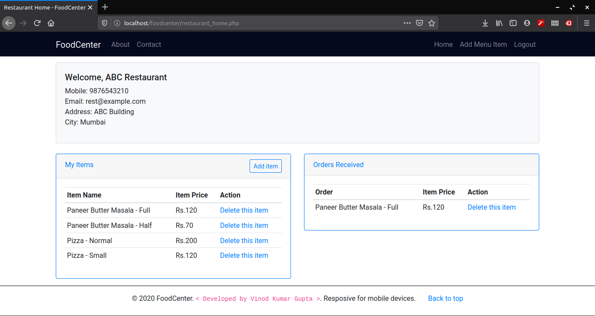

# Food Center

A simple Food ordering system.

## Technologies Used

- HTML/CSS/JS
- Bootstrap 4
- PHP
- MySQL

## How to run on local machine

**Requirements**

- Local computer should have Apache Web Server and PHP 7 installed.

- Any modern browser like Firefox or Chrome

**Steps**

- Clone the repository (`git clone <repo-url>`) or download the ZIP of the repository.

- Move the folder to Apache HTML root directory(e.g. `/var/www/html/` in case of Linux)

- Create database in MySQL using the SQL dump provided i.e. `foodcenter.sql`

- Open browser and enter the URL like `http://localhost/<folder-name>`. 

## Screenshots

### Index Page

### Products Page

### Restaurant Registration Page

### Customer Home Page

### Restaurant Home Page

## Author

Vinod Kumar Gupta (https://github.com/vkgupta857)